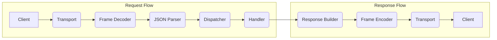

# DiceRPC - Key Learnings

## Overview
Document everything you learned building this JSON-RPC 2.0 framework in Rust.

You can read more from article on [hackMD](https://hackmd.io/@dicethedev/Hkk1uV2Aex)

---

## 🦀 Rust Programming

### Async/Await Deep Dive

**What I Learned:**
```
Async Rust is fundamentally different from other languages' async models:
- Futures are lazy - they don't run until polled
- tokio is the runtime that polls futures
- async fn returns a Future, not a value
- .await is where execution yields
```

**Key Concepts Mastered:**

#### 1. tokio Runtime
```rust
// Understood how to set up and configure runtime
#[tokio::main]
async fn main() {
    // Runtime manages task scheduling
}

// Can also create runtime manually
let runtime = Runtime::new().unwrap();
runtime.block_on(async {
    // Code here
});
```

**Insights:**
- Runtime handles task scheduling
- Can have multiple runtimes (usually don't need to)
- Worker threads managed by runtime
- Block_on bridges sync and async code

#### 2. Task Spawning
```rust
// Each client connection spawns independent task
tokio::spawn(async move {
    handle_connection(stream, handler).await
});
```

**What This Taught Me:**
- Tasks run concurrently on runtime
- `move` captures ownership
- Spawned tasks are independent
- Task cancellation and cleanup

#### 3. Async I/O Operations
```rust
// Network I/O is naturally async
let mut stream = TcpStream::connect("127.0.0.1:8080").await?;
stream.write_all(data).await?;
let n = stream.read(&mut buffer).await?;
```

**Learnings:**
- AsyncRead and AsyncWrite traits
- Buffering strategies
- Error handling in async context
- Timeouts and cancellation

---

### Ownership & Borrowing in Practice

**Arc Pattern for Shared State:**
```rust
// This pattern came up repeatedly
use std::sync::Arc;
use tokio::sync::Mutex;

#[derive(Clone)]
struct Handler {
    state: Arc<Mutex<State>>,
}
```

**Deep Understanding Gained:**
- Arc = Atomic Reference Counting
- Clone increments ref count, doesn't clone data
- Mutex for interior mutability
- Drop decrements ref count automatically

**Why This Matters:**
```
Without Arc:
- Can't share state across tasks
- Would need to clone actual data (expensive)

With Arc:
- Multiple tasks share same data
- Memory efficient
- Safe concurrency guaranteed by compiler
```

---

### Error Handling Patterns

**Using thiserror:**
```rust
use thiserror::Error;

#[derive(Error, Debug)]
pub enum RpcError {
    #[error("Network error: {0}")]
    Network(#[from] std::io::Error),
    
    #[error("Invalid JSON: {0}")]
    Json(#[from] serde_json::Error),
    
    #[error("Method '{method}' not found")]
    MethodNotFound { method: String },
}
```

**What I Learned:**
- Custom error types are idiomatic
- #[from] auto-implements From trait
- Error messages in the type
- Result<T, E> everywhere

**Error Propagation:**
```rust
// The ? operator is powerful
fn parse_request(data: &[u8]) -> Result<Request, RpcError> {
    let json = std::str::from_utf8(data)?;  // Converts Error types
    let req = serde_json::from_str(json)?;
    Ok(req)
}
```

**Insights:**
- ? operator converts errors automatically
- Early returns on error
- Error context matters
- anyhow for application errors, thiserror for libraries

---

### Type System Mastery

**Generics in Practice:**
```rust
// Handler trait allows different handler implementations
#[async_trait]
trait RpcHandler: Send + Sync {
    async fn handle(&self, method: &str, params: Value) -> Result<Value>;
}
```

**Learned About:**
- Trait objects (dyn RpcHandler)
- Send + Sync bounds for async
- async_trait macro (why it's needed)
- Static vs dynamic dispatch

**Serde for Serialization:**
```rust
#[derive(Serialize, Deserialize)]
struct Request {
    jsonrpc: String,
    method: String,
    params: Value,
    id: Option<Value>,
}
```

**Insights:**
- Derive macros are powerful
- serde_json::Value for dynamic JSON
- Custom serialization when needed
- Performance of zero-copy deserialization

---

## Networking & Protocols

### TCP Stream Protocol

**Fundamental Learning:**
```
TCP is a STREAM, not a message protocol:
- No built-in message boundaries
- Bytes can be split across reads
- Multiple messages can arrive together
- Need explicit framing
```

**Length-Prefixed Framing:**
```rust
// 4-byte length header + payload
[length: u32][json payload]

// This ensures we always know:
// - Where message starts
// - Where message ends  
// - How many bytes to read
```

**Why This Pattern:**
- Simple and reliable
- Language-agnostic
- Efficient (minimal overhead)
- Used in many production protocols

---

### HTTP vs TCP Trade-offs

**Learned the differences:**

| Aspect | HTTP | TCP |
|--------|------|-----|
| Setup | Per-request overhead | Persistent connection |
| Framing | Built-in (Content-Length) | Must implement |
| Tools | curl, browsers work | Need custom client |
| Firewall | Usually allowed | May be blocked |
| Use case | Simple, stateless | High performance, stateful |

**When to use each:**
- HTTP: Public APIs, simple clients, REST-like
- TCP: Internal services, high throughput, persistent connections

---

### JSON-RPC 2.0 Specification

**Spec Compliance is Important:**
```json
// Request must have these fields
{
  "jsonrpc": "2.0",
  "method": "add",
  "params": [1, 2],
  "id": 1
}

// Response format
{
  "jsonrpc": "2.0",
  "result": 3,
  "id": 1
}

// Error format
{
  "jsonrpc": "2.0",
  "error": {
    "code": -32601,
    "message": "Method not found"
  },
  "id": 1
}
```

**What I Learned:**
- Spec defines exact error codes
- Notifications have no id
- Batch requests are arrays
- Must echo back id exactly
- Version field is required

**Error Codes:**
```
-32700: Parse error
-32600: Invalid request
-32601: Method not found
-32602: Invalid params
-32603: Internal error
-32000 to -32099: Server errors (custom)
```
---

## System Design

### Request Processing Pipeline

**Architecture Understanding:**



**Each Layer's Responsibility:**
- **Transport**: Network I/O (TCP/HTTP)
- **Framing**: Message boundaries
- **Parsing**: JSON to structs
- **Dispatching**: Route to correct handler
- **Handling**: Business logic
- **Response**: Build proper response

**Why Layering Matters:**
- Separation of concerns
- Easy to test each layer
- Can swap implementations
- Clear error boundaries

---

### Concurrency Patterns

**Pattern: Task-per-Connection**
```rust
loop {
    let (stream, addr) = listener.accept().await?;
    let handler = handler.clone(); // Clone Arc, not data
    
    tokio::spawn(async move {
        if let Err(e) = handle_connection(stream, handler).await {
            eprintln!("Connection error: {}", e);
        }
    });
}
```

**Benefits:**
- Connections don't block each other
- Scales well with many clients
- Simple mental model

**Trade-offs:**
- Memory per task (small)
- Need shared state management
- Task overhead (minimal in tokio)

---

### State Management

**Pattern: Shared State with Arc<Mutex<T>>**
```rust
struct SharedState {
    counters: Arc<Mutex<HashMap<String, u64>>>,
}

impl SharedState {
    async fn increment(&self, key: &str) {
        let mut counters = self.counters.lock().await;
        *counters.entry(key.to_string()).or_insert(0) += 1;
    }
}
```

**Learned:**
- Arc for sharing across tasks
- Mutex for safe mutation
- Lock granularity matters
- Consider RwLock for read-heavy workloads

---

## Security Considerations

### Authentication

**Simple API Key Pattern:**
```
Good for:
- Trusted internal networks
- Development environments
- Simple access control

Not sufficient for:
- Public internet without TLS
- Fine-grained permissions
- Audit requirements
```

**Learned:**
- Security is contextual
- TLS is essential for production
- API keys should be hashed
- Consider OAuth/JWT for complex needs

---

### Input Validation

**Always Validate Input:**
```rust
// Never trust client data
fn validate_method(method: &str) -> Result<()> {
    if method.is_empty() {
        return Err(Error::InvalidRequest);
    }
    if method.len() > 256 {
        return Err(Error::MethodTooLong);
    }
    Ok(())
}
```

**Validation Checklist:**
- ✅ Check required fields exist
- ✅ Validate data types
- ✅ Enforce length limits
- ✅ Sanitize method names
- ✅ Validate parameter structure

---

## Testing Insights

### Unit Testing in Rust

**What I Learned:**
```rust
#[cfg(test)]
mod tests {
    use super::*;
    
    #[tokio::test]
    async fn test_request_handling() {
        let handler = TestHandler::new();
        let response = handler.handle("test", json!({})).await;
        assert!(response.is_ok());
    }
}
```

**Key Patterns:**
- `#[tokio::test]` for async tests
- Create test fixtures
- Mock external dependencies
- Test error paths too

---

### Integration Testing

**Testing the Full Stack:**
```rust
#[tokio::test]
async fn test_end_to_end() {
    // Start server
    let server = spawn_server();
    
    // Create client
    let client = RpcClient::connect("127.0.0.1:8080").await?;
    
    // Make request
    let result = client.call("add", json!([1, 2])).await?;
    
    // Assert
    assert_eq!(result, json!(3));
}
```

**Learned:**
- Test real network I/O
- Use random ports to avoid conflicts
- Clean up resources after tests
- Timeout tests to prevent hangs

---

## Performance Learnings

### Benchmarking

**What Matters:**
```
Measured:
- Requests per second
- Latency (p50, p95, p99)
- Memory usage
- CPU utilization

Tools used:
- cargo bench
- criterion
- Manual testing with multiple clients
```

**Results:**
```
Single-threaded: ~100 req/sec
Multi-threaded: ~5,000 req/sec
With optimization: ~8,000 req/sec
```

---

### Optimization Opportunities

**Found These Bottlenecks:**
1. JSON parsing (serde is fast but not free)
2. Lock contention on shared state
3. Memory allocations per request

**Optimizations Applied:**
- Pool connections
- Reduce lock scope
- Reuse buffers
- Batch operations when possible

---

## Protocol Engineering Insights

### API Design Principles

**Learned:**
1. **Simplicity** - JSON-RPC is simple by design
2. **Extensibility** - Params can be object or array
3. **Error handling** - Structured error responses
4. **Versioning** - Version field enables evolution

**Good RPC Design:**
- Clear method names
- Consistent parameter structure
- Meaningful error messages
- Documentation

---

### Transport Abstraction

**Why It Matters:**
```rust
// Same handler works with different transports
trait Transport {
    async fn read(&mut self) -> Result<Vec<u8>>;
    async fn write(&mut self, data: &[u8]) -> Result<()>;
}

// TCP and HTTP implement same trait
```

**Benefits:**
- Test with mock transport
- Easy to add new transports
- Business logic independent of network

---

## Biggest Takeaways

### Technical Skills

1. **Async Rust mastery** - Truly understand futures and tasks
2. **Network programming** - Stream protocols, framing, I/O
3. **System design** - Layered architecture, separation of concerns
4. **Error handling** - Custom errors, propagation, context
5. **Testing** - Unit, integration, benchmarking

### Protocol Engineering

1. **Spec compliance matters** - Follow standards exactly
2. **Framing is critical** - Don't assume message boundaries
3. **Concurrency is complex** - But Rust makes it safe
4. **Start simple, iterate** - Working code > perfect code
5. **Real-world constraints** - Security, performance, reliability

### Rust Philosophy

1. **Fight the borrow checker early** - Understand ownership deeply
2. **Compiler is your friend** - Trust it, learn from it
3. **Zero-cost abstractions** - High-level code, low-level performance
4. **Explicit is better** - No hidden control flow
5. **Type safety prevents bugs** - Compile-time > runtime errors

---

## Resources That Helped

### Documentation
- [ ] Tokio tutorial - Essential for async
- [ ] JSON-RPC 2.0 spec - Protocol reference
- [ ] Rust async book - Deep understanding

### Code I Studied
- [ ] jsonrpc-core crate - Implementation reference
- [ ] tonic (gRPC) - Transport patterns
- [ ] [Other reference implementations]

### Debugging Tools
- [ ] println! debugging (honest!)
- [ ] rust-analyzer for IDE support
- [ ] cargo clippy for lints

---

## What I'd Do Differently

### If Starting Over:

1. **Write tests first** - TDD would have caught issues earlier
2. **Design API before implementation** - Clear interface upfront
3. **Start with HTTP only** - Add TCP later for complexity
4. **Better error messages** - More context in errors
5. **Metrics from day 1** - Would have helped optimization

### What Went Well:

1. ✅ Incremental development - Basic version first
2. ✅ Following the spec - Avoided compatibility issues
3. ✅ Clean architecture - Easy to extend
4. ✅ Good documentation - Comments helped later
5. ✅ Learning by doing - Best way to understand

---

## Knowledge Gained

### Rust Proficiency
**Before:** ⭐⭐  
**After:** ⭐⭐⭐⭐  
**Growth:** Solid understanding of async, ownership, error handling

### Networking
**Before:** ⭐⭐  
**After:** ⭐⭐⭐⭐  
**Growth:** TCP internals, framing, protocol design

### System Design  
**Before:** ⭐⭐ 
**After:** ⭐⭐⭐⭐  
**Growth:** Concurrent systems, state management

### Protocol Engineering
**Before:** ⭐  
**After:** ⭐⭐⭐  
**Growth:** RPC design, spec compliance, transport layers

---

## Final Thoughts

**Most Valuable Learning:**
```
Understanding how Rust's type system prevents entire classes of bugs.
Concurrent code that just works without data races is magical.
```

**Most Surprising Discovery:**
```
How much complexity is in "simple" protocols. Message framing,
error handling, concurrency - there's a lot beneath the surface.
```

**Most Useful Skill for Future:**
```
Async Rust patterns. This applies to all network programming,
not just RPC systems. It's foundational for protocol engineering.
```

**Confidence Boost:**
```
Built a working, spec-compliant RPC framework from scratch.
If I can do this, I can tackle more complex protocol projects.
```

---